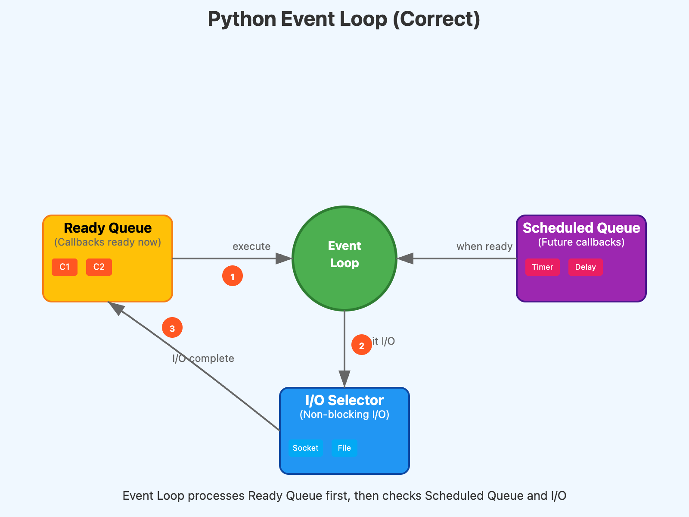
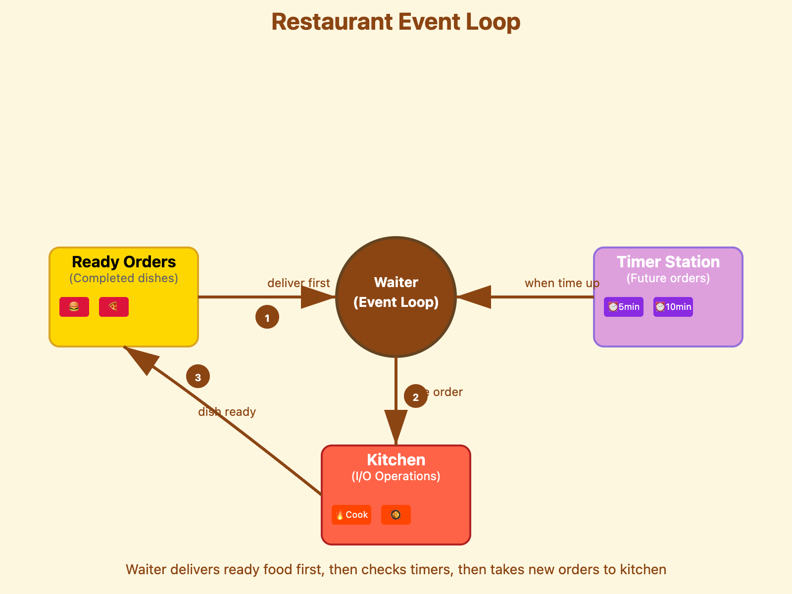

# asyncio

- [asyncio](https://docs.python.org/3/library/asyncio.html)
  - what problem does it solve?: asyncio is a library to write concurrent code using the async/await syntax. Asyncio is often a perfect fit for `IO-bound` and high level structured network code.
  - If I'm not familiar with other similar terms, [where to learn it conceptually](https://www.youtube.com/watch?v=K56nNuBEd0c)
  - terms to understand:
    - synchronous & asynchronous
    - [subroutine and coroutine](https://youtu.be/K56nNuBEd0c?si=KlwKIRFeVu3Y3rPR&t=111)
      - subroutine: can't be stopped and paused
      - coroutine: can be stopped or paused. coroutine maintain state between pauses
  - `asyncio` uses event loop mechanism under the hood, you can refer to resources below:
    - read the `4. Asynchronous Programming section` of [An Introduction to Asynchronous Programming in Python](https://medium.com/velotio-perspectives/an-introduction-to-asynchronous-programming-in-python-af0189a88bbb)
    - [asyncio-eventloop](https://docs.python.org/dev/library/asyncio-eventloop.html)
    - to have a visualized understanding about event loop, see diagram below
   
    - to have a conceptual understanding about event loop using real world scenarios analogy, see the restaurant event loop explanation below

## Understanding Event Loop with Restaurant Analogy

**Restaurant Event Loop Walkthrough:**

🏪 **The Restaurant Setup:**

- **Waiter** = Event Loop (manages everything)
- **Order Queue** = Task Queue (new customer orders)
- **Kitchen** = I/O Operations (cooking food)
- **Ready Tray** = Ready Queue (completed dishes waiting for delivery)

**Step-by-Step Flow:**

1️⃣ **New Orders (Task Queue → Event Loop)**

- Customers place orders: "Burger", "Pizza", "Salad"
- Waiter picks up order slips from counter

2️⃣ **Send to Kitchen (Event Loop → I/O Operations)**

- Waiter hands orders to kitchen
- Kitchen starts cooking (HTTP requests, file reads, database queries)
- Waiter doesn't wait around - moves to next task

3️⃣ **Food Ready (I/O Operations → Ready Queue)**

- Kitchen rings bell: "Order #5 ready!"
- Completed dishes placed on ready tray
- Multiple orders can finish at different times

4️⃣ **Priority Delivery (Ready Queue → Event Loop)**

- Waiter always checks ready tray FIRST
- Delivers completed food before taking new orders
- This prevents food from getting cold (avoiding task starvation)

**Key Insight:** Waiter never stands idle waiting for kitchen. Always serving customers or delivering ready food, maximizing restaurant efficiency.
