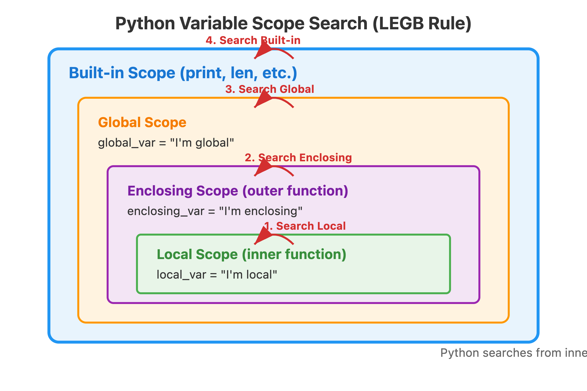

# Keyword

## Control Flow

- `if`, `elif`, `else` - conditional statements for decision making
- `for`, `while` - loops for repeating code
- `break` - exits a loop early
- `continue` - skips to the next iteration of a loop
- `pass` - placeholder that does nothing (useful for empty code blocks)

## Functions and Classes

- `def` - defines a function
- `return` - returns a value from a function
- `class` - defines a class
- `self` - refers to the current instance in a class method
- `super` - called inside the __init__ constructor function to inherit from parent class

## Boolean and Logic

- `True`, `False` - boolean values
- `and`, `or`, `not` - logical operators
- `is` - checks if two variables refer to the same object
- `in` - checks if something is contained within something else

### Logic Operator Example

```python
# AND operator - both conditions must be True
age, has_license = 25, True
if age >= 21 and has_license:
    print("Can rent a car!")

# OR operator - at least one condition must be True  
weather, day = "rainy", "weekend"
if weather == "sunny" or day == "weekend":
    print("Going out!")

# NOT operator - reverses the boolean value
is_raining = False
if not is_raining:
    print("Perfect for a walk!")

# Combining operators with parentheses
age, has_permit, has_adult = 16, True, True
if (has_permit and has_adult) or age >= 18:
    print("Can drive!")

# Working with "truthy" and "falsy" values
username = "john123"
if username and not " " in username and len(username) >= 5:
    print("Valid username!")

# Common falsy values: [], "", 0, None, False
empty_list = []
if not empty_list:
    print("List is empty!")

# use case of `is`
empty_list2 = empty_list
if empty_list is empty_list2:
    print("they are the same object")
```

## Variables and Values

- `None` - represents "nothing" or null value
- `global` - declares a variable as global scope
- `nonlocal` - refers to variables in enclosing scope
- dive into variable scope:

    ```python
    # WRONG - These are NOT how you use global/nonlocal
    # global my_var = 10  # Syntax error!
    # local my_var = 5    # 'local' isn't even a keyword!

    # CORRECT - How global and nonlocal actually work:

    x = 10  # Global variable

    def example():
        # This creates a NEW local variable (doesn't affect global x)
        x = 20
        print(x)  # Prints 20

    def modify_global():
        global x  # DECLARATION: "I want to modify the global x"
        x = 30    # Now this modifies the global x
        print(x)  # Prints 30

    def nested_example():
        y = 100
        
        def inner():
            nonlocal y  # DECLARATION: "I want to modify y from enclosing scope"
            y = 200     # Modifies the y in nested_example()
        
        inner()
        print(y)  # Prints 200

    # Test it out:
    print(x)           # 10
    example()          # 20
    print(x)           # Still 10 (global unchanged)
    modify_global()    # 30
    print(x)           # Now 30 (global was changed)
    nested_example()   # 200

    # Without global/nonlocal, Python assumes you're creating new local variables
    def no_declaration():
        x = 999  # Creates new local x, doesn't touch global
        
    no_declaration()
    print(x)  # Still 30, not 999
    ```

- Key points:
  - `global` is a keyword that declares you want to modify a global variable
  - `nonlocal` is a keyword that declares you want to modify a variable from an enclosing scope
  - `local` is NOT a Python keyword - variables are local by default inside functions
  - These are declarations, not prefixes - you write them on separate lines

**Python uses what's called the LEGB Rule - it searches through nested contexts from inner to outer:**.



## Exception Handling

- `try` - starts a block that might cause an error
- `except` - handles specific errors
- `finally` - code that runs regardless of errors
- `raise` - manually triggers an exception

## Import and Modules

- `import` - brings in external modules
- `from` - imports specific parts from a module
- `as` - creates an alias for imports

## Other Important Ones

- `with` - context manager (great for file handling)
- `lambda` - creates small anonymous functions
- `yield` - used in generators (more advanced)

Start with the control flow and function keywords first - these form the backbone of most Python programs. The others you'll naturally encounter as you write more code!

```
