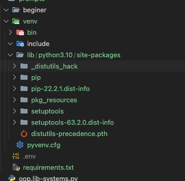

# Python Virtual Environments - Learning Notes

## Core Concept

Python venv = nvm-style environment that hosts specific packages for a project

## Command Breakdown

`python -m venv venv`

- Creates isolated Python environment
- Second `venv` = directory name
- Like creating a project-specific Node.js installation

## Why It Matters

- **Dependency isolation**: Different projects, different package versions
- **Clean system**: No global package pollution
- **Reproducible**: Same environment across machines
- **Easy cleanup**: Delete folder = everything gone

## The Flow

1. `python -m venv venv` - Create environment
2. `source venv/bin/activate` - Enter environment (Linux/Mac)
3. `pip install -r requirements.txt` - Install project packages
4. Work on project - All packages come from `venv`
5. `deactivate` - Exit environment

## Where Packages Live

```sh
project/
├── venv/
│   └── lib/python3.x/site-packages/  # Packages installed HERE
├── requirements.txt                   # Package list (like package.json)
└── main.py                           # Your code
```

see  actual example below:




## Switch to your virtual env

- Before Activation

```bash
$ which python
/usr/bin/python          # System Python

$ which pip
/usr/bin/pip             # System pip

$ python -c "import sys; print(sys.path)"
['/usr/lib/python3.x', ...]  # System Python paths

- After source venv/bin/activate

```bash
$ which python
/path/to/project/venv/bin/python  # venv Python

# now switched to your project virtual envrionment
$ which pip
/path/to/project/venv/bin/pip     # venv pip

$ python -c "import sys; print(sys.path)"
['/path/to/project/venv/lib/python3.x/site-packages', ...]  # venv paths first
```

## Learn By Analogy

- **venv** = Project toolbox
- **requirements.txt** = Tool shopping list
- **pip install** = Fill the toolbox
- **activate** = Pick up the toolbox
- Each project gets its own separate toolbox

- **nvm**: Switches Node versions + global packages
- **venv**: Same Python version + isolated package sets
- For Python version switching: use `pyenv`
